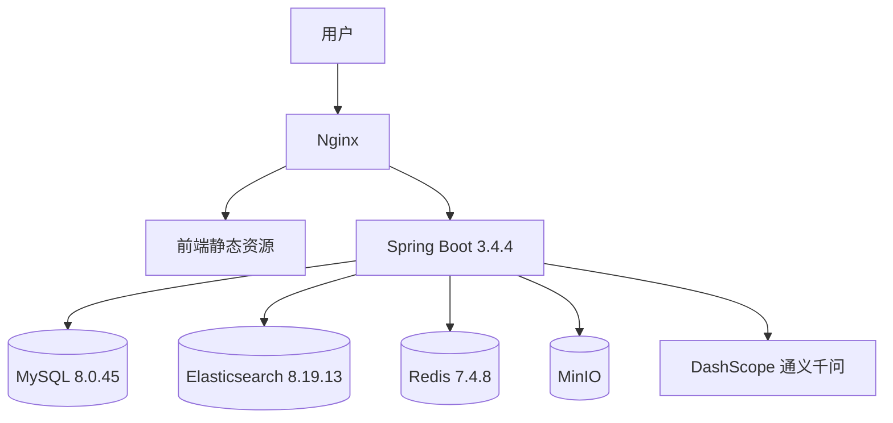

# MyWeb 个人网站技术规范文档

**文档版本**: v1.3  
**更新日期**: 2026-03-23  
**关联文档**: `需求文档.md`

本文档只描述**方案与约定**，不包含具体代码实现示例。

---

## 一、架构概览

### 1.1 系统架构说明

- **用户访问**：经 Nginx（TLS 终止、反向代理、静态资源）；生产环境必须启用 HTTPS。
- **前端**：Vue 3 + Vite 构建产物由 Nginx 托管；通过同源或配置好的跨域访问后端 REST API。
- **后端**：单一 **Spring Boot 3.4.4**（Java 21）进程提供业务 API、搜索编排、文件服务及 **AI 能力**；AI 非独立微服务，而是在应用内通过 **Spring AI Alibaba 1.1.2.2** 调用阿里云 DashScope（通义千问），并与 Elasticsearch、Redis、MySQL、MinIO 协同。
- **数据层**：MySQL 为权威业务库；Elasticsearch 为搜索与 RAG 召回；Redis 为会话与热点缓存；MinIO 为对象存储。本地与联调环境由 Docker Compose 编排；生产需单独评估 **Elasticsearch 是否与业务同机**（2 核 4G 下同机风险高，建议升配或 ES 独立节点）。

### 1.2 逻辑结构示意（Mermaid）

### 1.3 技术栈总览

| 层级 | 技术/工具 | 版本/说明 |
|------|----------|----------|
| **前端** | Vue | 3.5.30（Composition API） |
| | UI | 自定义为主 + Element Plus 2.13.6 |
| | 样式 | SCSS + CSS 变量 |
| | 动画 | GSAP 3.14.2 + Vue 内置过渡 |
| | HTTP | Axios |
| | 构建 | Vite 8.0.2 |
| **后端** | Java | 21 (LTS) |
| | Spring Boot | **3.4.4** |
| | Spring AI Alibaba | **1.1.2.2**（与 [GitHub Releases Latest](https://github.com/alibaba/spring-ai-alibaba/releases) 对齐；升级前核对官方 BOM 与模块拆分） |
| | Elasticsearch | 服务端 8.19.13；Java API 客户端主版本与集群一致 |
| | 向量存储（RAG） | Spring AI 官方 **`spring-ai-starter-vector-store-elasticsearch`**（`ElasticsearchVectorStore`）+ DashScope **`EmbeddingModel`**（`spring-ai-alibaba-starter-dashscope`）；版本与 **Spring AI BOM**、**Spring AI Alibaba 1.1.2.2** 对齐，以各自发布说明为准 |
| | MySQL | Connector 随 Spring Boot 管理或与 MySQL 8.0.45 实例匹配 |
| | Redis | Redis 7.4.8（Lettuce / Spring Boot 默认客户端） |
| | MinIO | Java SDK 8.x 当前稳定版 |
| **基础设施** | Nginx、Docker、Docker Compose | Alpine / Compose V2 |

**依赖管理建议**：使用 `spring-boot-starter-parent` 或官方 BOM 统一管理 Spring 生态版本；Spring AI Alibaba 使用 **1.1.2.2**，具体 `artifactId`（如 starter-dashscope、starter 合集等）以官方 1.1.2.2 发布说明与示例工程为准，避免沿用已废弃的里程碑坐标。

---

## 二、前端技术规范

### 2.1 项目目录结构（约定）

- `public/`：静态资源  
- `src/api/`：接口封装  
- `src/assets/`：图片、字体；`styles/` 下放 `variables.scss`、`mixins.scss`、`global.scss`  
- `src/components/common|layout|chat/`：通用、布局、聊天  
- `src/composables/`、`router/`、`stores/`（Pinia）、`views/`（各页面）、`utils/`  
- 根目录：`index.html`、`package.json`、`tsconfig.json`、`vite.config.ts`  

### 2.2 配色变量（语义约定）

在 `:root` 或 SCSS 变量中定义下列语义，色值可与设计微调：

| 语义 | 说明 | 参考色值方向 |
|------|------|----------------|
| primary / primary-light / primary-dark | 主色阶 | 莫兰迪青系，如 #7D9D9C、#9DB5B2、#5A7A79 |
| secondary | 辅助 | 莫兰迪紫 #B8A9C9 |
| accent | 强调 | 莫兰迪橙 #E6B8A2 |
| bg-primary / bg-secondary / bg-card | 背景 | 米白 #F7F5F3、暖灰 #EDE8E3、卡片白 #FFFFFF |
| text-primary / secondary / muted | 文字 | #2C3E50、#5D6D7E、#95A5A6 |
| border | 分割线 | #D5D5D5 |
| success / warning / error | 功能色 | 与主色阶协调，避免高饱和 |

### 2.3 动画规范

| 类型 | 时长 | 缓动 | 场景 |
|------|------|------|------|
| 页面过渡 | 约 300ms | ease-in-out | 路由切换 |
| 元素淡入 | 约 400ms | ease-out | 进入视口 |
| 悬停上浮 | 约 200ms | ease-out | 卡片约 4px 位移 |
| 按钮 | 约 150ms | ease | 状态变化 |

---

## 三、后端技术规范

### 3.1 后端包结构（约定）

- 启动类、`config/`（ES、Redis、MinIO、Web/CORS 等）  
- `controller/`、`service/`、`repository/`、`entity/`、`dto/`、`vo/`  
- `ai/`：对话编排、RAG 检索封装（命名可与团队习惯一致）  
- `common/`：统一响应体、分页模型  
- `resources/`：`application.yml` 及 `application-dev|prod.yml`；`prompts/` 下存放系统提示词 Markdown  

### 3.2 双写同步策略（MySQL + Elasticsearch）

- 写路径以 **MySQL 事务**为准：文章、项目等变更先落库（作为权威业务数据源）。  
- 在同一事务中记录 **Outbox 事件**（例如 `es_index_outbox`）：保证“业务提交成功”与“索引更新任务可投递”具备一致性，避免双写丢消息。  
- 请求返回成功后由后台 **Relay/Worker** 消费 Outbox 事件执行 ES 写入：  
  - 全文索引（BM25）写入失败：自动重试，失败超过阈值进入死信/告警；不回滚已提交业务（允许搜索最终一致）。  
  - 向量索引写入失败：自动重试，并记录 `sourceId` 以支持重放。  
- 生产应配套：**定时对账**、**按 ID 全量/增量重建索引**；当 embedding 模型/维度变化时触发 **向量索引全量重建**。  

### 3.3 Elasticsearch 索引与分词（稳定默认方案）

**默认推荐**：使用 **`icu_analyzer`**（需安装 `analysis-icu` 插件）。开发与生产镜像中固定插件安装与版本。  
扩展（可选）：若后续需要更极致词粒度，可引入 **IK**，但需在文档中固定镜像版本与插件版本，并说明升级/重建策略。

**博客索引字段（逻辑）**：文档 ID、标题（text + keyword 子字段便于排序聚合）、正文、摘要、标签、分类、创建/更新时间、阅读量等。

**项目索引字段（逻辑）**：ID、名称（text）、描述、技术栈 keyword、GitHub/Demo 等 URL 用 keyword。

**高亮**：搜索 API 返回高亮片段字段，由前端渲染；具体 highlighter 类型与 fragment 大小在实现时按 ES 8 文档配置。

### 3.4 RAG 方案（基线）

- **召回（关键词）**：Elasticsearch **全文检索（BM25）**，在用户搜索框、管理端检索等场景使用；也可作为 RAG 的一路召回。  
- **生成**：将系统提示词、可选多轮历史、检索到的片段一并交给 **Spring AI Alibaba** 的 Chat 能力（通义千问），生成回答并返回可追溯的引用（如 `sourceType`、`sourceId`、标题）。  
- **推荐组合**：个人站知识量有限时，**混合召回（BM25 + 向量）** 对同义词与口语问法更稳。  
融合策略：使用 **RRF（Reciprocal Rank Fusion）** 融合两路 TopK，默认 `k=60`，避免分数尺度不可比导致的某一路压过另一讲。

### 3.5 向量检索实现方案（当前稳定推荐）

本方案与现有技术选型对齐：**不在业务「全文索引」上硬塞 `dense_vector`**，而是采用 **独立向量索引 + Spring AI 标准抽象**，便于升级与运维。

#### 3.5.1 组件与职责

| 组件 | 选型 | 职责 |
|------|------|------|
| 嵌入模型 | DashScope **text-embedding-v3**（固定模型版本与输出维度） | 索引写入用 `document` 文本类型，用户提问用 `query` 文本类型（DashScope 文档约定，利于检索质量） |
| 嵌入 Bean | Spring AI Alibaba 自动配置的 **`EmbeddingModel`**（`spring-ai-alibaba-starter-dashscope`，`spring.ai.model.embedding=dashscope`） | 与 Chat 共用 API Key 与配额管理 |
| 向量存储 | Spring AI **`ElasticsearchVectorStore`**（依赖 **`spring-ai-starter-vector-store-elasticsearch`**） | `similaritySearch`、元数据过滤、与 ES 8 `dense_vector` / kNN 能力对接 |
| ES 连接 | Spring Boot **`spring.elasticsearch.*`** | 与现有 ES 集群共用 URI/账号；向量索引与全文索引 **分索引**（见下） |

引入向量能力时，请在构建中同时引入 **Spring AI BOM**（版本与 Spring AI Alibaba 1.1.2.2 发行说明兼容的那一版），避免 `spring-ai-starter-vector-store-elasticsearch` 与传递依赖冲突；`co.elastic.clients:elasticsearch-java` 主版本须与 **ES 服务端大版本一致**（Spring AI 文档对旧 Boot 线曾要求客户端不低于 8.13.3，3.4 线以实际 BOM 解析为准）。  

**向量维度锁定（建议你写死）**：本项目固定 embedding 维度为 **768**（在 `text-embedding-v3` 的 `dim` 参数/配置锁定，并在 ES VectorStore options 里保持一致）。  
一旦更换 embedding 模型或维度，必须触发 **向量索引全量重建**。

#### 3.5.2 索引与数据模型（逻辑）

- **全文索引**（已有）：`blog`、`project`（或合并前缀），负责站点搜索、高亮、BM25 RAG 片段。  
- **向量索引**（新增）：单独命名（如 `myweb-rag-vector`），仅存放 RAG 用的 **文本块** 与 **向量**，由 `ElasticsearchVectorStore` 管理映射；**维度**与 `spring.ai.vectorstore.elasticsearch.dimensions` 及所选 DashScope 模型输出 **严格一致**（本项目固定为 768 维，以你锁定的 `options.dimensions` 为准）。  
- **相似度**：默认 **cosine**（与 Spring AI ES VectorStore 默认一致）；若模型文档建议点积且向量已归一化，可评估改为 `dot_product`。  

**切块（Chunking）**：对“所有需要纳入知识库的公开内容类型”（博客、项目、about/experience/home 精选摘要、公开文件引用等）按结构化方式切分为“摘要块”。默认参数：单块目标约 **500 tokens**，overlap **10%-20%**；每个 `sourceId` 最大块数建议 **<= 12**，避免超长页面导致向量成本失控。  
每块写入 `Document` 的 **metadata**：`sourceType`（如 blog/project/about/experience/home/file 等）、`sourceId`、业务主键、`chunkIndex`、`title`、公开 URL 路径等，便于过滤与前端展示引用。

#### 3.5.3 写入与更新管道（与 MyWeb 业务结合）

1. 管理端发布/更新/删除文章或项目：MySQL 为权威；同步 **全文索引**（现有双写逻辑）。  
2. **异步任务**：根据 `sourceId` 删除该来源在向量索引中的旧块，再对最新内容生成“摘要/关键字段块”、调用 **`EmbeddingModel`**（`document` 类型）、**`VectorStore.add`**。  
3. 大批量历史迁移：离线脚本或管理端「重建向量索引」按钮，分批嵌入，避免打满 DashScope QPS。  
4. 失败重试与告警：嵌入或 ES 写入失败写入死信表或日志，支持按 `sourceId` 重放。  

#### 3.5.4 查询与混合召回（对话 RAG）

1. 用户输入 → 使用 **`EmbeddingModel`** 生成查询向量（**`query` 文本类型**）。  
2. **`VectorStore.similaritySearch`**：默认 `topK=6`；默认 `similarityThreshold=0.75`（cosine 语义下过滤弱相关，可按数据微调）；支持 metadata 过滤（如仅“公开源集合”、按 `sourceType` 白名单筛选）。
3. **可选 BM25 旁路**：用同一用户问题查全文索引，取 `topK=4` 以内片段；与向量结果使用 **RRF** 融合，再按 `sourceId` 去重与截断总 token。
4. 将最终召回到的“摘要/关键字段片段”注入提示词 → **通义千问** 生成回答（向量库不存全文细节）；当需要更精确回答时，可通过 `sourceId` 再从全文索引（BM25）或业务库拉取对应详情作为“可选补齐上下文”。

#### 3.5.5 知识库构建规则（Chunking & Metadata）

- **知识库范围**：默认覆盖你网站所有对外公开内容类型（前台页面与公开条目，包括但不限于首页精选摘要、关于我、项目列表/详情、博客列表/详情摘要、经历时间线节点、以及公开文件引用的可解析文本摘要）。联系表单提交内容、草稿/私有内容等不纳入知识库。
- **文件解析边界（默认稳定做法）**：`Markdown/纯文本` 直接解析并切块入库；`图片文件` 默认不做 OCR、不直接 embedding（向量库仅保留图片对应的可公开 URL 作为来源引用）；如未来支持 OCR，需补充质量抽样与回放策略，避免噪声污染召回。
- **文本规范**：对每个内容源生成“可嵌入摘要文本”（例如标题、关键段落、要点列表、短引用片段），用于 embedding；向量索引只存摘要/关键字段与元数据，不保存全文级别的详细内容。
- **切块策略**：按“语义段落/要点”切分摘要块，控制每块大小（字符数或 token 上限），可配置少量 overlap 提升跨段召回；对单条内容设置最大块数上限，避免超长页面把向量成本做大。
- **向量写入入口径**：写入向量索引时使用 `document` 文本类型；对话检索生成查询向量时使用 `query` 文本类型（与 DashScope embedding 文档约定保持一致）。
- **metadata 约定**：每个向量块至少写入 `sourceType`、`sourceId`、`title`、`url`、`chunkIndex`，并建议写入 `chunkTextHash` 用于去重/一致性校验；如返回引用时需要展示“摘要”，也可在向量文档里保留短 `snippet` 字段或其派生内容（长度受控）。
- **一致性与更新方式**：发布/更新走“异步重建”（先清旧块再写新块），删除走“按 sourceId 清理向量块”；当切块策略或 embedding 模型/维度变更时，支持全量重建向量索引。
- **可追溯引用**：RAG 返回的引用字段必须能映射回业务实体（至少 `title + url`），保证前端可展示来源并支持跳转。

#### 3.5.6 配置与运维要点

- **`spring.ai.vectorstore.elasticsearch.initialize-schema`**：开发环境可开启自动建索引；**生产建议关闭**，由发布流水线或运维执行索引模板，避免误删映射。  
- **密钥与计费**：嵌入与 Chat 均走 DashScope，需单独评估 **日均写入块数** 与 **对话 QPS** 的配额与费用。  
- **资源**：向量索引会增加 ES 磁盘与堆占用；2 核 4G 同机部署时向量维度与 `topK` 宜保守，或 **ES 独立节点**。  
- **版本升级**：升级 Spring AI / Spring AI Alibaba 时优先阅读 **Upgrade Notes**，复核 `ElasticsearchVectorStore` 与 `EmbeddingModel` 的 Bean 名称与配置前缀是否变更。  

### 3.6 Spring AI Alibaba 与 DashScope（对话）

- 通过 **环境变量或密钥管理**注入 API Key，禁止写入仓库。  
- 模型名称选用当前 DashScope 文档中的对话模型（如 qwen-plus 等），按成本与效果在配置中切换。  
- 系统提示词说明助手身份、仅基于站点公开内容回答、无法回答时的措辞、可引导用户访问的页面类型；细节以 `prompts/chat-system.md` 维护。  

### 3.7 AI 会话与记忆

| 类型 | 介质 | 内容 | 策略 |
|------|------|------|------|
| 短期上下文 | Redis | 当前会话最近若干轮对话（结构化 JSON 或列表，保证顺序与 Chat API 一致） | TTL 建议 30 分钟无活动 |
| 长期记录 | MySQL | 会话元数据、消息正文、可选 token 与引用文档 ID | 持久化，供审计与「继续对话」 |
| RAG 知识 | Elasticsearch | **全文索引**（BM25）+ **独立向量索引**（语义召回，见 3.5） | 随内容发布更新；向量更新走异步管道，非对话日志 |

**流程要点**：读 Redis 历史 → **向量相似度检索（主）** 与可选 **BM25 片段** 合并 → 组装消息 → 调用模型 → 写回 Redis → 异步或同步写入 MySQL（按性能与一致性要求选择）。

**数据模型要点**：会话表含 `session_id`（唯一）、时间戳等；消息表关联会话，外键指向会话的唯一键；字段类型与索引满足查询与清理策略即可。

### 3.8 API 约定

- **统一响应**：业务码、说明文案、`data` 载荷、服务端时间戳（或 ISO 时间）；具体字段名团队统一即可。  
- **主要路径（示例）**：博客列表与筛选、搜索、详情、创建/更新（触发双写）；项目列表与详情；**AI 聊天流式（SSE）POST**；文件上传至 MinIO。
- **AI 聊天流式（SSE）接口约定（Spring MVC）**：  
  - 技术实现：后端使用 `Spring MVC` 返回 `SseEmitter`，响应头 `Content-Type: text/event-stream`；流式期间将 Spring AI 的 token/片段流映射为 SSE 事件。  
  - 事件约定：`delta`（增量文本片段）、`done`（生成结束，可包含 `messageId`/耗时/用量）、`error`（错误信息）。  
  - 心跳：在流式过程中按需发送 `ping`（例如 15s 一次，客户端忽略该事件），防止中间代理空闲断连。  
  - 生命周期：在 `onCompletion/onTimeout/onError` 中释放资源并终止下游订阅，避免内存泄漏。
- **安全**：管理后台使用 **JWT + Spring Security** 鉴权；接口限流、CORS 白名单；上传类型与大小校验；联系表单启用“分层防刷”（honeypot + IP/邮箱 rate limit，必要时启用 Turnstile/验证码）。

---

## 四、基础设施配置

### 4.1 资源与部署注意（2 核 4G）

下表为**同机 Docker 时的量级参考**，总和易逼近物理内存上限，**仅建议开发或轻量访问**；生产请升配或将 **Elasticsearch 迁出**。

| 服务 | 内存参考 | 说明 |
|------|----------|------|
| Nginx | 约 128MB 级 | 静态与反代 |
| Spring Boot | 约 512MB～1.5GB | 按实测 `-Xmx` 调整 |
| MySQL | 约 256～512MB | 视数据量 |
| Elasticsearch | 约 512MB～1GB | 单节点开发常见；堆与宿主机需留余量 |
| Redis / MinIO | 各约 256MB 级 | 视缓存与对象量 |

### 4.2 Docker Compose 服务清单（约定）

- **nginx**：`nginx:1.28.2-alpine`，暴露 80/443，挂载配置与前端 `dist`。
- **app**：后端镜像，依赖 MySQL、ES、Redis、MinIO；`SPRING_PROFILES_ACTIVE` 区分环境。  
- **mysql**：`mysql:8.0.45`，库名与账号由环境变量注入。
- **elasticsearch**：`docker.elastic.co/elasticsearch/elasticsearch:8.19.13`；单节点 discovery 与环境变量按 ES 8 官方文档；**开发可临时关闭安全插件简化联调，生产必须启用认证与 TLS**。
- **redis**：`redis:7.4.8-alpine`；生产建议密码与持久化策略。
- **minio**：`minio/minio:RELEASE.2026-03-17T21-25-16Z`（固定稳定 RELEASE tag）；控制台端口单独映射；数据目录 **必须挂卷**。

Compose 文件版本字段遵循当前 Docker Compose 规范（可省略过时 `version` 键）。

### 4.3 环境变量（分类说明）

- 数据库：root/业务库用户名密码、库名  
- Redis：密码（若有）  
- MinIO：root 用户与密码（生产强密码）  
- DashScope：`DASHSCOPE_API_KEY` 或官方推荐变量名  
- 应用：JWT 密钥、ES 连接 URL 与账号等  

敏感变量仅通过部署环境注入，不入库不入镜像。

---

## 五、依赖与版本策略（无代码清单）

### 5.1 后端

- 以 **Spring Boot 3.4.4** 的依赖管理为主；额外库（ES Java API、MinIO、Spring AI Alibaba）版本与 BOM 冲突时 **以 Spring Boot 与 Spring AI Alibaba 官方兼容矩阵为准**。
- **Spring AI Alibaba 固定 1.1.2.2**，升级时同步阅读 [Release Notes](https://github.com/alibaba/spring-ai-alibaba/releases)。  
- 启用向量 RAG 时：在 BOM 下增加 **Spring AI** 的 **`spring-ai-starter-vector-store-elasticsearch`**，与 **`spring-ai-alibaba-starter-dashscope`**（嵌入）组合；具体坐标与版本以 [Spring AI 向量库文档](https://docs.spring.io/spring-ai/reference/api/vectordbs/elasticsearch.html) 与当前 BOM 为准。  

### 5.2 前端

- `vue`、`vue-router`、`pinia`、`axios`、`element-plus`、`gsap`、`marked`、`highlight.js` 等取 **当前稳定主版本**；`vite`、`@vitejs/plugin-vue`、`sass`、`typescript` 置于开发依赖。  
- 锁文件（pnpm/npm/yarn）纳入版本控制，保证可复现构建。  

---

## 六、注意事项

1. **Elasticsearch**：堆内存与宿主机留余量；生产开启安全特性，与「关闭安全仅开发」的 Compose 示例区分。  
2. **DashScope**：注意配额、计费与限流；可对聊天接口做限流与熔断。  
3. **双写**：监控 ES 写入失败率，具备重建索引能力；若启用向量索引，需具备 **按来源重建嵌入** 的能力（模型或维度变更时全量重嵌入）。  
4. **MinIO 与 rustfs 无缝切换（S3 兼容契约）**：文件读写与对外访问必须只依赖 S3 兼容语义（仅使用 Put/Get/List/Delete，预签名 URL 由后端生成；禁止使用 MinIO 私有 API）；寻址与签名层面统一采用 `path-style`（`/<bucket>/<key>` 形式）与固定 `region=us-east-1` 的 SigV4 签名，减少“MinIO vs rustfs 处理差异”导致的兼容风险；对象 `key` 的编码规则由应用统一约定为 UTF-8 的 RFC3986 percent-encoding，保留 `/` 作为层级分隔并避免 double-encode，确保历史对象在任意后端间可定位；访问 URL 的 base 域名通过配置注入（对接 MinIO/rustfs 的外部可访问地址），避免容器内域名泄漏；对象命名前缀与结构由应用统一生成（例如 `myweb/<resourceType>/<yyyy>/<MM>/<uuid>` 形式），从而保证“切换存储后 key 空间不变”；在联调/CI 引入契约测试（同一批 key 与同一批预期行为在 MinIO 与 rustfs 两种后端均通过：Put 后可 Get、List 可见、预签名可下载），以此作为“可无缝切换”的验收门槛。  
5. **HTTPS**：生产强制 TLS（如 Let’s Encrypt）。  
6. **同机资源**：2 核 4G 运行 ES + JVM 应用偏紧，文档与需求已建议升配或分离 ES。  

---

**文档维护**：技术方案或官方版本变更时同步更新本文档与 `需求文档.md`。
